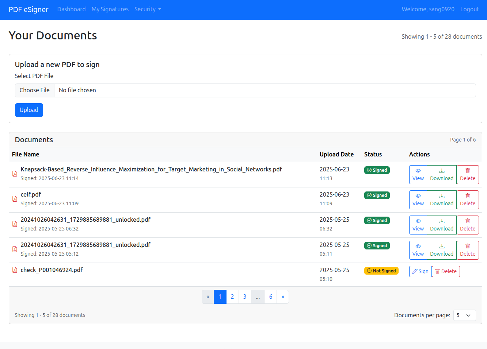
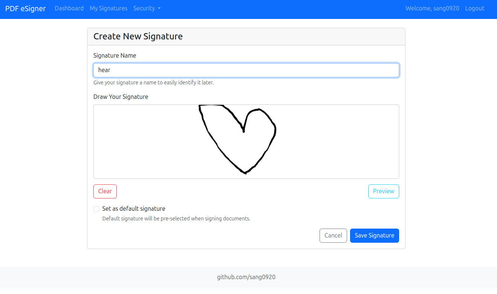
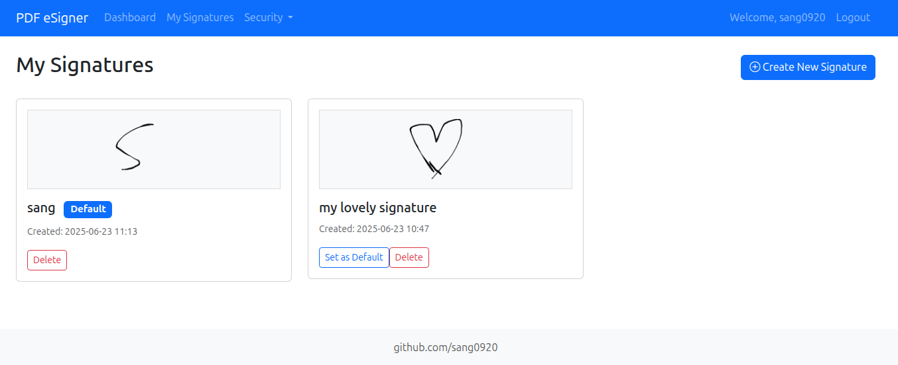
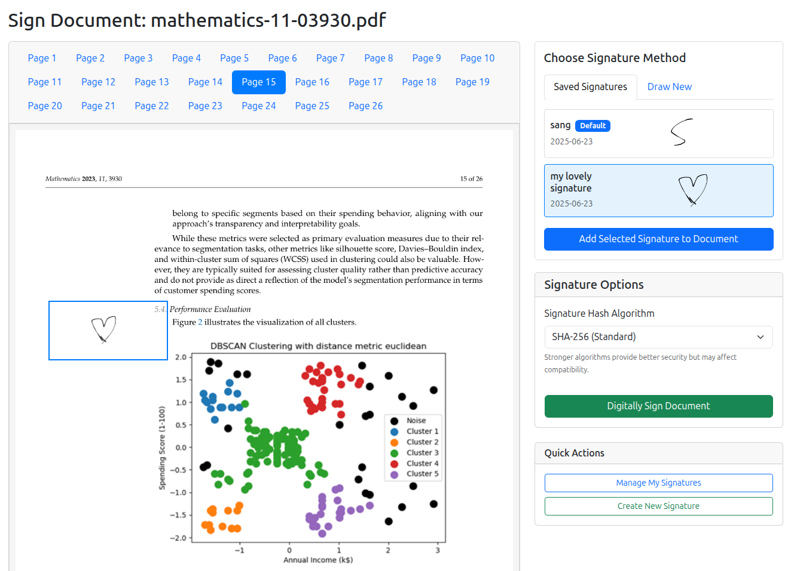
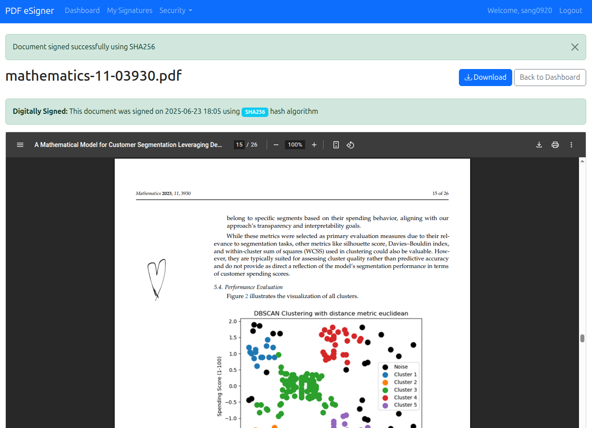
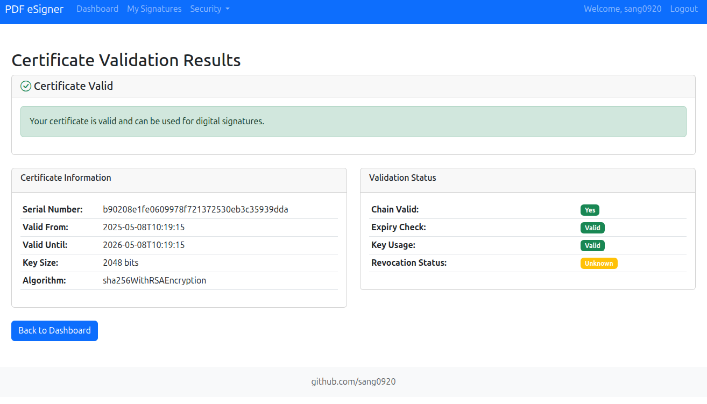
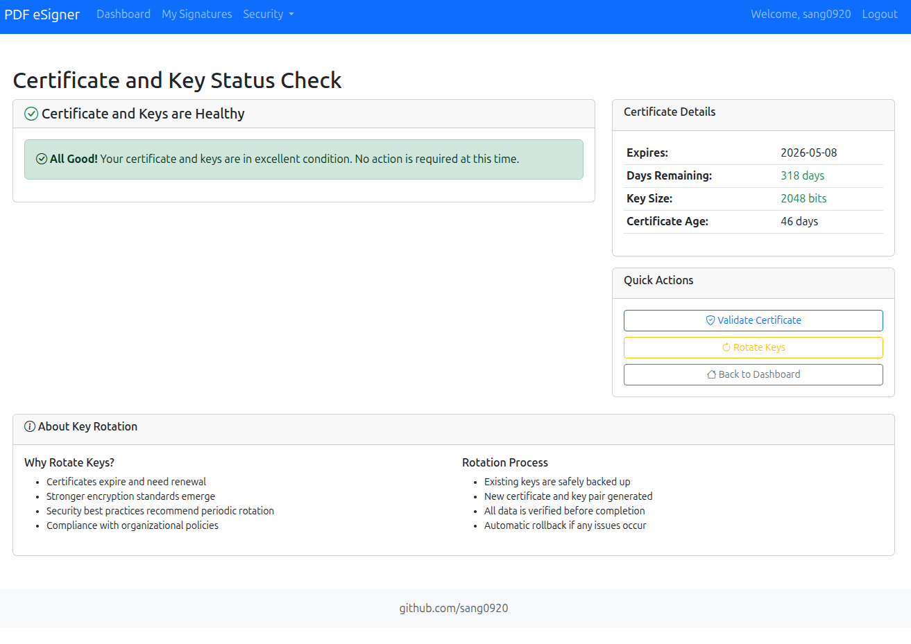
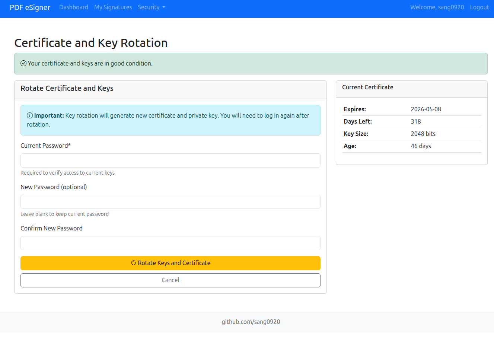

# PDF eSigner Application

A comprehensive digital signature platform for PDF documents compliant with **PAdES (PDF Advanced Electronic Signatures)** standards. This application implements advanced cryptographic algorithms and security features for document authentication, integrity verification, and non-repudiation.

> **🌐 Live Demo**: [https://esign-odwx.onrender.com/](https://esign-odwx.onrender.com/)

> **Academic Project**: "Nghiên cứu về các giải thuật mã hóa và hàm băm để xây dựng ứng dụng chứng thực thông điệp" 
> (Research on encryption algorithms and hash functions to build message authentication applications)

> **Signature Validation**: Verify signed documents at [Vietnam National Electronic Authentication Center (NEAC)](https://neac.gov.vn/)

## 🚀 Key Features

### 🔐 **Advanced Security & Cryptography**
- **Multiple Hash Algorithms**: SHA-256, SHA-384, SHA-512, SHA3-256, SHA3-512
- **RSA 2048-bit Encryption**: Secure key pair generation and digital signatures
- **X.509 Certificate Management**: Self-signed and CA-issued certificate support
- **Vietnam CA Integration**: Support for Vietnam National Root CA certificates

### 📱 **User Experience & Interface**
- **Responsive Web Design**: Bootstrap 5-based UI that works on all devices
- **Interactive PDF Viewer**: Multi-page PDF preview with tabbed interface
- **Visual Signature Creation**: Canvas-based signature drawing with save/reuse
- **Drag-and-Drop Positioning**: Precise signature placement with real-time coordinates

### 🔒 **Enterprise Security Features**
- **Two-Factor Authentication**: Re-authentication for sensitive operations
- **Certificate Validation**: Comprehensive certificate chain validation
- **Key Rotation System**: Automated key expiry monitoring and rotation
- **Admin Dashboard**: Certificate status monitoring for all users
- **Audit Trail**: Complete logging of all signature operations

### 📄 **Document Management**
- **Batch Processing**: Upload and manage multiple PDF documents
- **Secure Storage**: Encrypted file storage with user isolation
- **Search & Filter**: Advanced document filtering and pagination

## 📦 Installation & Setup

### **Local Development Setup**

1. **Clone and Setup**
   ```bash
   git clone https://github.com/sang0920/eSign.git
   cd eSign
   python -m venv .venv
   
   # Activate virtual environment
   # Windows: .venv\Scripts\activate
   # macOS/Linux: source .venv/bin/activate
   ```

2. **Install and Run**
   ```bash
   pip install -r requirements.txt
   cd esign-app
   pip install -r requirements.txt
   python fix_database_migration.py
   python app.py
   ```

3. **Access**: Open `http://127.0.0.1:5000` or use the live demo above

## 📸 Application Screenshots

### **Dashboard - Document Management Hub**


The main dashboard provides a centralized view of all documents with:
- **Document Upload**: Drag-and-drop PDF upload with file validation
- **Status Indicators**: Clear visual distinction between signed and unsigned documents
- **Action Buttons**: Quick access to sign, view, download, and delete operations
- **Pagination**: Efficient navigation through large document collections
- **Document Metadata**: Upload dates, file sizes, and signature status

### **Signature Creation - Digital Canvas**


Professional signature creation interface featuring:
- **HTML5 Canvas**: Smooth drawing experience with pressure sensitivity
- **Signature Preview**: Real-time preview of created signatures
- **Management Tools**: Save, name, and set default signatures
- **Quality Controls**: Clear and redraw functionality
- **Responsive Design**: Works on both desktop and mobile devices

### **Signature Management - Template Library**


Comprehensive signature management system:
- **Signature Gallery**: Visual preview of all saved signatures
- **Default Selection**: Mark frequently used signatures as default
- **Organization Tools**: Name, date, and usage tracking
- **Quick Actions**: Edit, delete, and set default options
- **Template Reuse**: Easy selection for document signing

### **Document Signing Interface - Professional Workflow**


Advanced document signing interface with:
- **Multi-page PDF Preview**: Navigate through document pages with tabs
- **Signature Positioning**: Drag-and-drop signature placement with pixel precision
- **Dual Signature Options**: Choose between saved signatures or create new ones
- **Algorithm Selection**: Multiple hash algorithms (SHA-256, SHA-384, SHA-512, SHA3-256, SHA3-512)
- **Real-time Coordinates**: Live tracking of signature position
- **Visual Feedback**: Clear indication of signature placement

### **Document Viewer - Signed Document Display**


Clean document viewing experience:
- **PDF Rendering**: High-quality document display
- **Signature Verification**: Visual confirmation of applied digital signatures
- **Download Options**: Access to both original and signed versions
- **Metadata Display**: Signature details including algorithm used and timestamp
- **Navigation Controls**: Easy return to dashboard

### **Certificate Validation - Security Assessment**


Comprehensive certificate health monitoring:
- **Validation Status**: Clear pass/fail indicators with detailed explanations
- **Certificate Details**: Serial number, expiry date, key size, and algorithm information
- **Chain Validation**: Certificate authority chain verification
- **Security Warnings**: Proactive alerts for certificate issues
- **Compliance Check**: Verification against industry standards

### **Key Status Monitoring - Proactive Security**


Intelligent key rotation monitoring system:
- **Risk Assessment**: Color-coded urgency levels (Critical, High, Medium, Low)
- **Expiry Tracking**: Days remaining until certificate expiration
- **Recommendations**: Actionable advice for maintaining security
- **Certificate Information**: Key size, age, and validity period
- **Quick Actions**: Direct access to key rotation and validation tools

### **Key Rotation - Security Maintenance**


Professional key rotation interface:
- **Security Warnings**: Clear indication of the importance of key rotation
- **Password Management**: Secure handling of current and new passwords
- **Backup Strategy**: Automatic backup of existing keys before rotation
- **Progress Tracking**: Step-by-step rotation process with verification
- **Risk Mitigation**: Rollback capabilities in case of issues

## 🔬 Cryptographic Research Components

### **Educational Implementations**
- **Hash Functions**: SHA-256, SHA-384, SHA-512, SHA3-256, SHA3-512 with demonstrations
- **Encryption**: AES-256-CBC, RSA encryption with key management
- **Digital Signatures**: Step-by-step signature creation and verification

### **Security Analysis Tools**
```bash
python main.py  # Run cryptographic demonstrations
# Choose option 2 for crypto demos
# Choose option 3 for OpenSSL operations
```

## 📊 Project Structure

```
eSign/
├── esign-app/                   # Main Flask application
│   ├── app.py                   # Application entry point
│   ├── models.py                # Database models
│   ├── templates/               # HTML templates
│   ├── static/css/style.css     # Custom styling
│   ├── utils/                   # Utility modules
│   │   ├── crypto.py            # Cryptographic functions
│   │   ├── pdf.py               # PDF processing
│   │   ├── security.py          # Security utilities
│   │   └── key_rotation.py      # Key management
│   ├── keys/                    # User key storage
│   ├── uploads/                 # Document storage
│   └── signatures/              # Signature images
├── assets/screenshots/           # Application screenshots
├── trust_store/                 # Certificate authority files
├── main.py                      # Cryptographic research demos
└── requirements.txt             # Dependencies
```

## 🔮 Future Enhancements

- [ ] Multi-language support (Vietnamese, English)
- [ ] Mobile application development
- [ ] Integration with external Certificate Authorities (VietSign, FPT-CA)
- [ ] API development for third-party integration
- [ ] Cloud storage integration
- [ ] Blockchain integration for audit trails

## 👨‍💻 Developer & Links

**Đỗ Thế Sang**
- **GitHub**: [@sang0920](https://github.com/sang0920)
- **Source Code**: [https://github.com/Sang0920/eSign](https://github.com/Sang0920/eSign)
- **Email**: dothesang20@gmail.com
- **Institution**: Ho Chi Minh University of Industry and Trade (HUIT)

### **Academic Context**
- **Course**: Advanced Cryptography and Information Security
- **Academic Year**: 2024-2025
- **Research Focus**: Practical implementation of digital signature standards

---

*This project demonstrates practical application of cryptographic algorithms in real-world software development, combining academic research with industry-standard security practices and Vietnamese digital signature compliance.*

