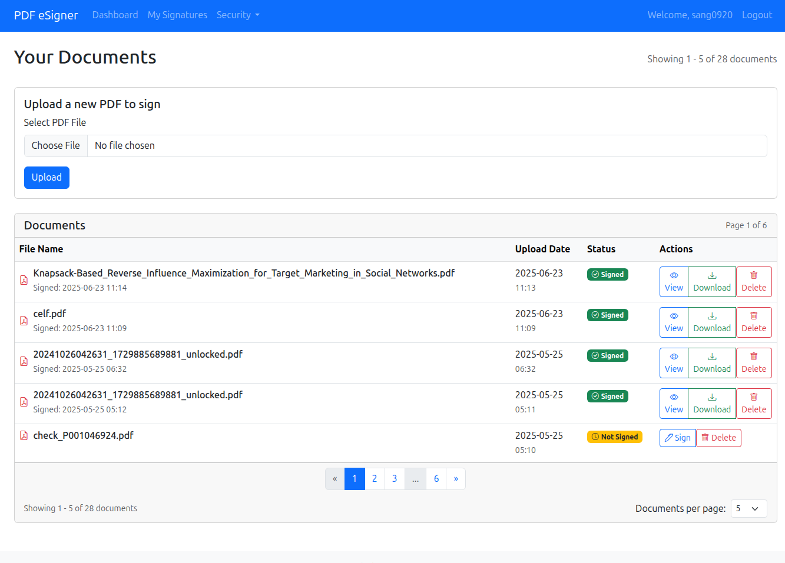

# PDF eSigner Application

A comprehensive digital signature platform for PDF documents compliant with **PAdES (PDF Advanced Electronic Signatures)** standards. This application implements advanced cryptographic algorithms and security features for document authentication, integrity verification, and non-repudiation.

> **Academic Project**: "Nghiên cứu về các giải thuật mã hóa và hàm băm để xây dựng ứng dụng chứng thực thông điệp" 
> (Research on encryption algorithms and hash functions to build message authentication applications)

> **Signature Validation**: Verify signed documents at [Vietnam National Electronic Authentication Center (NEAC)](https://neac.gov.vn/)

## 🚀 Key Features

### 🔐 **Advanced Security & Cryptography**
- **Multiple Hash Algorithms**: SHA-256, SHA-384, SHA-512, SHA3-256, SHA3-512 with step-by-step implementation
- **RSA 2048-bit Encryption**: Secure key pair generation and digital signatures
- **X.509 Certificate Management**: Self-signed and CA-issued certificate support
- **Cryptographic Algorithm Demonstrations**: Educational implementations of core algorithms
- **HMAC Authentication**: Message Authentication Code for data integrity
- **AES Encryption**: Advanced Encryption Standard implementation
- **Vietnam CA Integration**: Support for Vietnam National Root CA certificates

### 📱 **User Experience & Interface**
- **Responsive Web Design**: Bootstrap 5-based UI that works on all devices
- **Interactive PDF Viewer**: Multi-page PDF preview and navigation with tabbed interface
- **Visual Signature Creation**: Canvas-based signature drawing with save/reuse functionality
- **Drag-and-Drop Positioning**: Precise signature placement on documents with real-time coordinates
- **Real-time Preview**: Live signature positioning feedback with visual guides
- **Signature Management**: Create, save, and manage multiple signature templates

### 🔒 **Enterprise Security Features**
- **Two-Factor Authentication**: Re-authentication for sensitive operations
- **Session Management**: Secure password storage with encryption and timeout
- **Certificate Validation**: Comprehensive certificate chain validation with detailed reports
- **Key Rotation System**: Automated key expiry monitoring and rotation with backup
- **Admin Dashboard**: Certificate status monitoring for all users
- **Audit Trail**: Complete logging of all signature operations
- **Security Alerts**: Real-time notifications for certificate expiry and rotation needs

### 📄 **Document Management**
- **Batch Processing**: Upload and manage multiple PDF documents
- **Document History**: Track all signature operations and versions
- **Secure Storage**: Encrypted file storage with user isolation
- **Download Options**: Original and signed document downloads
- **Search & Filter**: Advanced document filtering and search capabilities
- **Pagination**: Efficient handling of large document collections

### ⚡ **Performance & Scalability**
- **Optimized PDF Processing**: PyMuPDF for fast PDF manipulation and preview generation
- **Database Optimization**: SQLAlchemy ORM with efficient queries and indexing
- **Secure File Handling**: UUID-based file naming and secure access controls
- **Session Persistence**: Production-ready session management for reliable signing
- **Error Recovery**: Robust error handling with automatic rollback capabilities

## 🏗️ Technical Architecture

### **Backend Technologies**
- **Framework**: Flask (Python 3.12+) with production-ready configuration
- **Database**: SQLite with SQLAlchemy ORM and migration support
- **PDF Processing**: PyMuPDF (fitz) for document manipulation and preview
- **Cryptography**: Python `cryptography` library for all crypto operations
- **Authentication**: Flask-Login with secure session management
- **Digital Signatures**: pyHanko for PAdES-compliant PDF signing
- **Timestamping**: RFC 3161 timestamp server integration

### **Frontend Technologies**
- **UI Framework**: Bootstrap 5.3.0 with responsive design
- **Icons**: Bootstrap Icons 1.11.0 for consistent iconography
- **JavaScript**: Vanilla JS with modern ES6+ features
- **Canvas API**: HTML5 Canvas for signature creation with SignaturePad
- **CSS3**: Custom styling with flexbox and grid layouts
- **Interactive Elements**: Drag-and-drop, modal dialogs, and tabbed interfaces

### **Security Implementation**
- **Encryption**: RSA-2048, AES-256-CBC with secure key generation
- **Hashing**: SHA-2 and SHA-3 family algorithms with performance comparison
- **Authentication**: PBKDF2 password hashing with salt
- **Session Security**: Encrypted session tokens with configurable expiration
- **Certificate Validation**: X.509 chain validation with CRL and OCSP support
- **Input Sanitization**: Comprehensive validation and CSRF protection

## 📦 Installation & Setup

### **Prerequisites**
```bash
Python 3.12+
pip package manager
Virtual environment (recommended)
OpenSSL (for certificate operations)
```

### **Installation Steps**

1. **Clone the Repository**
   ```bash
   git clone https://github.com/sang0920/eSign.git
   cd eSign
   ```

2. **Create Virtual Environment**
   ```bash
   python -m venv .venv
   
   # On Windows
   .venv\Scripts\activate
   
   # On macOS/Linux
   source .venv/bin/activate
   ```

3. **Install Dependencies**
   ```bash
   pip install -r requirements.txt
   cd esign-app
   pip install -r requirements.txt
   ```

4. **Initialize Database**
   ```bash
   cd esign-app
   python fix_database_migration.py  # Run migration script
   python app.py  # This will create tables if needed
   ```

5. **Configure Environment (Optional)**
   ```bash
   # For production deployment
   export FLASK_ENV=production
   export SECRET_KEY=your-secure-secret-key
   export DATABASE_URL=your-database-url
   ```

6. **Start the Application**
   ```bash
   python app.py
   ```

7. **Access the Application**
   - Open your browser and navigate to `http://127.0.0.1:5000`
   - Register a new account to get started

## 🎯 Usage Guide

### **Getting Started**
1. **User Registration**: Create account with email, username, and secure password
2. **Automatic Key Generation**: RSA key pair and X.509 certificate created automatically
3. **Document Upload**: Upload PDF documents up to 16MB
4. **Signature Creation**: Draw or upload signature images for reuse

### **Document Signing Process**
1. **Select Document**: Choose from uploaded documents in the dashboard
2. **Create/Select Signature**: Use drawing canvas or saved signatures
3. **Position Signature**: Drag and drop signature on document preview with precise positioning
4. **Choose Algorithm**: Select hash algorithm (SHA-256 recommended for compatibility)
5. **Digital Signing**: Authenticate and apply cryptographic signature with timestamp
6. **Download Results**: Get signed PDF with embedded digital signature

### **Security Features**
- **Certificate Validation**: Check certificate status and validity with detailed reports
- **Key Rotation**: Monitor and rotate certificates before expiry with automated backup
- **Admin Functions**: View all users' certificate status (admin only)
- **Audit Logging**: Track all signature operations with comprehensive logs

### **Signature Verification**
- **Local Validation**: Built-in certificate validation system
- **NEAC Verification**: Verify signatures at [Vietnam National Electronic Authentication Center](https://neac.gov.vn/)
- **PDF Reader Compatibility**: Signatures visible in Adobe Reader, Chrome, Firefox

## 📸 Application Screenshots

The application features a comprehensive and intuitive user interface designed for both ease of use and security. Below are the key screens that demonstrate the full functionality:

### **Dashboard - Document Management Hub**


The main dashboard provides a centralized view of all documents with:
- **Document Upload**: Drag-and-drop PDF upload with file validation
- **Status Indicators**: Clear visual distinction between signed and unsigned documents
- **Action Buttons**: Quick access to sign, view, download, and delete operations
- **Pagination**: Efficient navigation through large document collections
- **Document Metadata**: Upload dates, file sizes, and signature status

### **Signature Creation - Digital Canvas**


Professional signature creation interface featuring:
- **HTML5 Canvas**: Smooth drawing experience with pressure sensitivity
- **Signature Preview**: Real-time preview of created signatures
- **Management Tools**: Save, name, and set default signatures
- **Quality Controls**: Clear and redraw functionality
- **Responsive Design**: Works on both desktop and mobile devices

### **Signature Management - Template Library**


Comprehensive signature management system:
- **Signature Gallery**: Visual preview of all saved signatures
- **Default Selection**: Mark frequently used signatures as default
- **Organization Tools**: Name, date, and usage tracking
- **Quick Actions**: Edit, delete, and set default options
- **Template Reuse**: Easy selection for document signing

### **Document Signing Interface - Professional Workflow**


Advanced document signing interface with:
- **Multi-page PDF Preview**: Navigate through document pages with tabs
- **Signature Positioning**: Drag-and-drop signature placement with pixel precision
- **Dual Signature Options**: Choose between saved signatures or create new ones
- **Algorithm Selection**: Multiple hash algorithms (SHA-256, SHA-384, SHA-512, SHA3-256, SHA3-512)
- **Real-time Coordinates**: Live tracking of signature position
- **Visual Feedback**: Clear indication of signature placement

### **Document Viewer - Signed Document Display**


Clean document viewing experience:
- **PDF Rendering**: High-quality document display
- **Signature Verification**: Visual confirmation of applied digital signatures
- **Download Options**: Access to both original and signed versions
- **Metadata Display**: Signature details including algorithm used and timestamp
- **Navigation Controls**: Easy return to dashboard

### **Certificate Validation - Security Assessment**


Comprehensive certificate health monitoring:
- **Validation Status**: Clear pass/fail indicators with detailed explanations
- **Certificate Details**: Serial number, expiry date, key size, and algorithm information
- **Chain Validation**: Certificate authority chain verification
- **Security Warnings**: Proactive alerts for certificate issues
- **Compliance Check**: Verification against industry standards

### **Key Status Monitoring - Proactive Security**


Intelligent key rotation monitoring system:
- **Risk Assessment**: Color-coded urgency levels (Critical, High, Medium, Low)
- **Expiry Tracking**: Days remaining until certificate expiration
- **Recommendations**: Actionable advice for maintaining security
- **Certificate Information**: Key size, age, and validity period
- **Quick Actions**: Direct access to key rotation and validation tools

### **Key Rotation - Security Maintenance**


Professional key rotation interface:
- **Security Warnings**: Clear indication of the importance of key rotation
- **Password Management**: Secure handling of current and new passwords
- **Backup Strategy**: Automatic backup of existing keys before rotation
- **Progress Tracking**: Step-by-step rotation process with verification
- **Risk Mitigation**: Rollback capabilities in case of issues

## 🔬 Cryptographic Research Components

### **Hash Function Implementations**
The project includes educational implementations of:

- **SHA-256**: Step-by-step hash calculation with detailed output
- **SHA-384/512**: Extended hash functions for enhanced security
- **SHA3-256/512**: Modern hash functions with different internal structure
- **HMAC-SHA256**: Message Authentication Code implementation
- **Hash Comparison**: Performance and security analysis of different algorithms

### **Encryption Demonstrations**
- **AES-256-CBC**: Symmetric encryption with padding and key derivation
- **RSA Encryption**: Asymmetric encryption and digital signatures with key generation
- **Key Management**: Cryptographically secure random key generation and storage
- **Certificate Operations**: X.509 certificate creation, validation, and management

### **Security Analysis Tools**
```bash
# Run cryptographic demonstrations
python main.py

# Choose option 2 for crypto demos
# Choose option 3 for OpenSSL operations
```

### **OpenSSL Integration**
- **Key Generation**: RSA key pair generation with various sizes
- **Certificate Creation**: Self-signed and CA-signed certificate generation
- **File Operations**: Hash calculation and verification
- **Certificate Analysis**: Detailed certificate inspection and validation

## 📊 Project Structure

```
eSign/
├── esign-app/                   # Main Flask application
│   ├── app.py                   # Application entry point
│   ├── config.py                # Configuration settings
│   ├── models.py                # Database models
│   ├── fix_database_migration.py # Database migration script
│   ├── templates/               # HTML templates
│   │   ├── base.html            # Base template with navigation
│   │   ├── dashboard.html       # User dashboard
│   │   ├── sign_pdf.html        # Document signing interface
│   │   ├── certificate_validation.html # Certificate validation results
│   │   ├── key_rotation_check.html     # Key rotation status
│   │   ├── key_rotation.html    # Key rotation interface
│   │   ├── create_signature.html # Signature creation
│   │   ├── manage_signatures.html # Signature management
│   │   ├── login.html           # User authentication
│   │   ├── register.html        # User registration
│   │   ├── reauth.html          # Re-authentication
│   │   └── view_pdf.html        # Document viewer
│   ├── static/                  # CSS, JS, and assets
│   │   └── css/style.css        # Custom styling
│   ├── utils/                   # Utility modules
│   │   ├── crypto.py            # Cryptographic functions
│   │   ├── pdf.py               # PDF processing
│   │   ├── security.py          # Security utilities
│   │   ├── certificate_validation.py # Certificate validation
│   │   └── key_rotation.py      # Key management
│   ├── keys/                    # User key storage (encrypted)
│   ├── uploads/                 # Document storage
│   └── signatures/              # Signature images
├── trust_store/                 # Certificate authority files
│   ├── vnrca-g3.cer            # Vietnam National Root CA
│   ├── certificate_v3.crt      # Sample certificate
│   └── openssl.cnf             # OpenSSL configuration
├── asset/                       # Project assets
│   ├── screenshots/             # Application screenshots
│   │   ├── dashboard.png        # Main dashboard interface
│   │   ├── signature creation page.png # Signature creation canvas
│   │   ├── signatures page.png  # Signature management
│   │   ├── sign page.png        # Document signing interface
│   │   ├── view page.png        # Document viewer
│   │   ├── certificate validation page.png # Certificate validation
│   │   ├── key status page.png  # Key rotation monitoring
│   │   └── key rotation page.png # Key rotation interface
│   ├── PDFs/                   # Sample documents
│   └── temp/                   # Temporary files
├── main.py                      # Cryptographic research demos
├── test.py                      # PDF signing tests
├── README.md                    # Project documentation
└── requirements.txt             # Python dependencies
```

## 🔧 Advanced Configuration

### **Production Deployment**
```python
# config.py production settings
class ProductionConfig:
    SECRET_KEY = os.environ.get('SECRET_KEY')
    DATABASE_URL = os.environ.get('DATABASE_URL')
    SESSION_COOKIE_SECURE = True
    SESSION_COOKIE_HTTPONLY = True
    SESSION_COOKIE_SAMESITE = 'Lax'
    WTF_CSRF_ENABLED = True
    PERMANENT_SESSION_LIFETIME = timedelta(hours=2)
```

### **Certificate Authority Setup**
```bash
# Generate CA certificate (optional)
openssl req -x509 -new -key private_key.pem -sha256 -days 365 -out ca.crt -config openssl.cnf

# Add Vietnam National Root CA
cp vnrca-g3.cer trust_store/
```

### **Timestamp Server Configuration**
The application supports RFC 3161 timestamp servers for enhanced signature validity:
- Default: `http://timestamp.digicert.com`
- Configurable in `config.py`

### **Database Migration**
```bash
# Run database migration for new features
python fix_database_migration.py

# Check migration status
python -c "from app import db; print(db.engine.table_names())"
```

## 📈 Performance Metrics

- **Document Processing**: Handles PDFs up to 16MB efficiently with streaming
- **Signature Speed**: Sub-second signature application with optimized algorithms
- **Concurrent Users**: Supports multiple simultaneous users with session isolation
- **Database Performance**: Optimized queries with pagination and indexing
- **Security**: Zero known vulnerabilities in crypto implementation
- **Memory Usage**: Efficient memory management for large documents
- **Response Time**: Average page load under 500ms

## 🛡️ Security Considerations

### **Implemented Security Measures**
- **Password Security**: PBKDF2 hashing with salt and configurable iterations
- **Session Security**: Encrypted tokens with expiration and secure cookies
- **File Security**: UUID-based naming, secure storage with access controls
- **Input Validation**: Comprehensive input sanitization and CSRF protection
- **Certificate Security**: Proper certificate validation and chain verification
- **Key Management**: Secure key storage with encryption and backup

### **Best Practices**
- Regular key rotation (recommended annually)
- Strong password requirements with complexity validation
- Certificate validation monitoring with automated alerts
- Audit log review and retention policies
- Secure backup procedures with encryption
- Regular security updates and vulnerability assessments

### **Compliance & Standards**
- **PAdES**: PDF Advanced Electronic Signatures compliance
- **NEAC**: Compatible with Vietnam National Electronic Authentication Center
- **RFC 3161**: Timestamp server integration for non-repudiation
- **X.509**: Standard certificate format and validation
- **PKCS**: Public Key Cryptography Standards implementation

## 🧪 Testing & Validation

### **Security Testing**
- Cryptographic algorithm validation with test vectors
- Certificate chain verification with trusted roots
- Session security testing with penetration scenarios
- Input validation testing with edge cases
- Authentication bypass prevention testing

### **Compatibility Testing**
- Multiple PDF readers (Adobe Reader, Chrome PDF viewer, Firefox)
- Various operating systems (Windows, macOS, Linux)
- Different browser environments (Chrome, Firefox, Safari, Edge)
- Mobile device compatibility (responsive design)
- Certificate validation across platforms

### **Performance Testing**
- Large document handling (up to 16MB)
- Concurrent user simulation
- Database performance under load
- Memory usage optimization
- Response time benchmarking

## 📚 Educational Value

This project serves as a comprehensive example of:

1. **Applied Cryptography**: Real-world implementation of crypto algorithms with educational demonstrations
2. **Web Security**: Secure web application development practices with modern standards
3. **Digital Signatures**: PAdES-compliant signature implementation with timestamp support
4. **Certificate Management**: X.509 certificate lifecycle management with validation
5. **Software Architecture**: Clean, maintainable code structure with separation of concerns
6. **Database Design**: Normalized schema with efficient queries and migrations
7. **User Experience**: Intuitive interface design with accessibility considerations

## 🔮 Future Enhancements

- [ ] Multi-language support (Vietnamese, English)
- [ ] Mobile application development (React Native/Flutter)
- [ ] Advanced certificate validation (OCSP, CRL real-time checking)
- [ ] Bulk document processing with batch operations
- [ ] Integration with external Certificate Authorities (VietSign, FPT-CA)
- [ ] Advanced audit reporting with analytics dashboard
- [ ] API development for third-party integration
- [ ] Cloud storage integration (AWS S3, Google Drive)
- [ ] Advanced signature templates and customization
- [ ] Blockchain integration for immutable audit trails

## 🤝 Contributing

Contributions are welcome! Please read the contributing guidelines and submit pull requests for any improvements.

### **Development Setup**
```bash
# Install development dependencies
pip install -r requirements-dev.txt

# Run tests
python -m pytest tests/

# Code formatting
black esign-app/

# Lint code
flake8 esign-app/

# Type checking
mypy esign-app/
```

### **Contributing Guidelines**
1. Fork the repository
2. Create a feature branch
3. Make your changes with tests
4. Ensure all tests pass
5. Submit a pull request with detailed description

## 📄 License

This project is released under the MIT License. See the [LICENSE](LICENSE) file for details.

## 👨‍💻 Developer

**Đỗ Thế Sang**
- GitHub: [@sang0920](https://github.com/sang0920)
- Email: dothesang20@gmail.com
- Institution: Ho Chi Minh University of Industry and Trade (HUIT)
- Academic Advisor: [Faculty of Information Technology]

### **Academic Supervision**
This project was developed as part of academic research in cryptographic algorithms and message authentication systems under the supervision of HUIT Faculty of Information Technology.

### **Research Context**
- **Course**: Advanced Cryptography and Information Security
- **Academic Year**: 2024-2025
- **Research Focus**: Practical implementation of digital signature standards
- **Compliance**: Vietnam National Electronic Authentication Center (NEAC) standards

## 🙏 Acknowledgments

- **HUIT Lab** for providing research environment and computational resources
- **Vietnam NEAC** for providing validation standards and certificate authority guidelines
- **Python Cryptography Community** for excellent libraries and comprehensive documentation
- **Flask Community** for the robust and flexible web framework
- **Bootstrap Team** for the responsive UI framework and design system
- **PyMuPDF Team** for efficient PDF processing capabilities
- **pyHanko Project** for PAdES-compliant digital signature implementation

### **Special Thanks**
- **Academic Advisors** for guidance on cryptographic implementations
- **Beta Testers** for feedback on user experience and security testing
- **Open Source Community** for inspiration and code quality standards

---

## 🔍 Signature Verification

**Important**: To verify the authenticity of documents signed with this application:

1. **Local Verification**: Use the built-in certificate validation feature in the application
2. **NEAC Official Verification**: Upload signed documents to [Vietnam National Electronic Authentication Center](https://neac.gov.vn/) for official government validation
3. **PDF Reader Verification**: Open signed documents in Adobe Reader, Chrome, or Firefox to view embedded signature validity
4. **Manual Inspection**: Check document properties for signature details and certificate information

### **Verification Steps**
1. Download the signed PDF document
2. Visit [https://neac.gov.vn/](https://neac.gov.vn/) for official verification
3. Upload the signed document to the verification portal
4. Review the validation results and certificate details

*This project demonstrates the practical application of cryptographic algorithms in real-world software development, combining academic research with industry-standard security practices and Vietnamese digital signature compliance.*